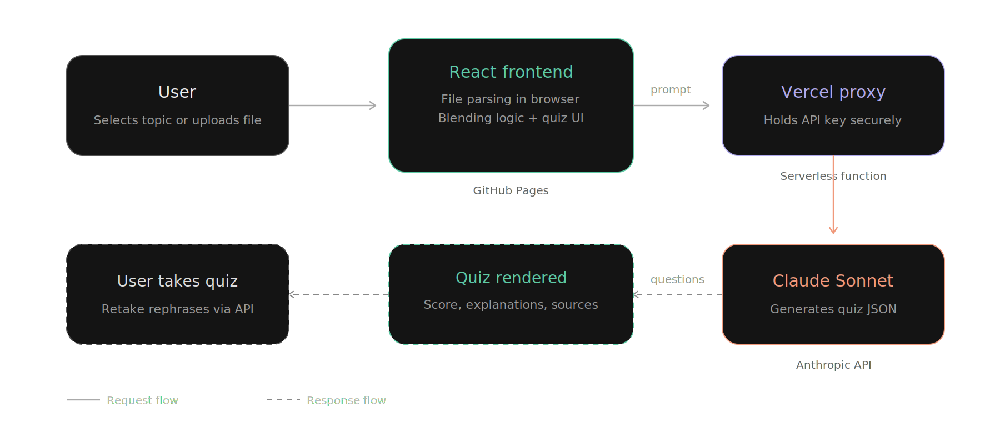
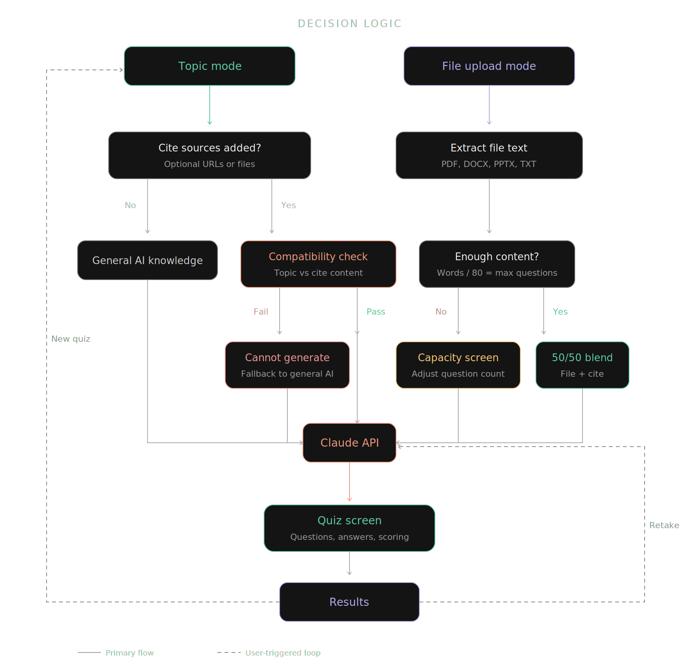

# QuizMind

AI-powered study quiz tool that generates multiple-choice questions from any topic or uploaded document.

**Live demo:** [hebronabel1.github.io/quizmind](https://hebronabel1.github.io/quizmind/)

---

## What it does

QuizMind takes a topic, subtopic, or uploaded file and generates a custom multiple-choice quiz using AI. Users control the number of questions (10–50), difficulty level, and can optionally cite external sources to shape question generation.

Supports PDF, Word, PowerPoint, and plain text uploads up to 50MB.

---

## Architecture



The frontend handles all user interaction, file parsing, and text extraction in the browser. API calls route through a Vercel serverless function that securely holds the API key. Claude generates quiz questions and returns structured JSON.

---

## Decision logic



The tool adapts its behavior based on input mode (topic vs file), whether cite sources are provided, and content volume. Key decision points:

- **Topic + no cite** → generates from general AI knowledge
- **Topic + cite** → checks source compatibility first, falls back to general AI if incompatible
- **File + enough content** → generates from file text only
- **File + thin content** → capacity screen lets user adjust question count or add sources
- **File + cite** → blends file and cite content (50/50 or cite-dominant depending on file depth)

---

## How questions are generated

A single API call handles generation. The prompt includes difficulty-specific instructions (Easy = recall, Medium = application, Hard = analysis), trimmed content (up to 7,000 characters), and a strict JSON output format. Front matter (copyright pages, TOC, metadata) is stripped before processing.

Retake mode calls the API again to rephrase every question — same concepts, different wording. Falls back to option shuffling if the API call fails.

---

## Tech stack

| Layer | Technology |
|-------|-----------|
| Frontend | React, DM Sans |
| File parsing | mammoth (DOCX), PDF.js (PDF), JSZip (PPTX) |
| AI engine | Claude Sonnet via Anthropic API |
| Backend proxy | Vercel Serverless Functions |
| Hosting | GitHub Pages via Vite |
| URL fetching | allorigins.win (CORS proxy) |

---

## Screen states

The tool has 7 distinct screens: access gate, home (topic/file selection), loading with real-time status, capacity warning (file too thin), cannot-generate warning (incompatible sources), quiz (questions + progress + scoring), and results (score breakdown + retake option).

---

## Project structure

```
quizmind/
├── src/
│   └── App.jsx          # Entire frontend (single component)
├── docs/
│   ├── architecture.png # System architecture diagram
│   └── logic-flow.png   # Decision logic flowchart
├── vite.config.js
└── package.json

quizmind-api/            # Separate repo (private)
├── api/
│   └── chat.js          # Vercel serverless proxy
└── package.json
```

---

Built by Hebron Abel — DePaul University
